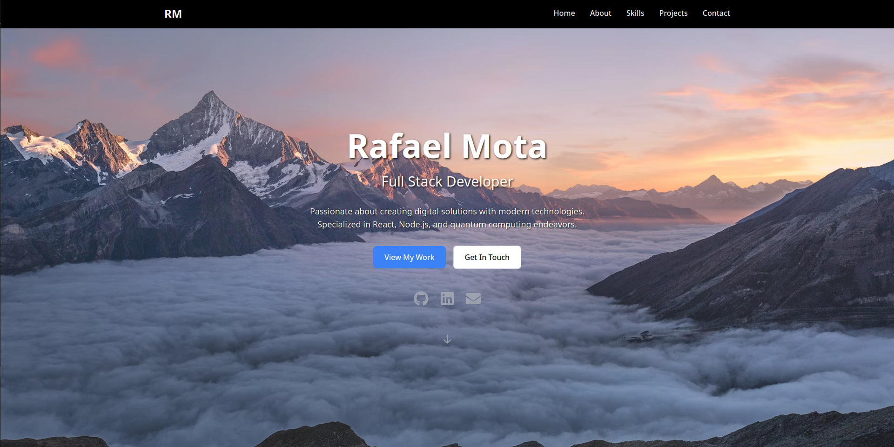

# Rafael Mota - Portfolio

A modern, responsive portfolio website showcasing my journey as a developer, highlighting full-stack development projects and quantum computing explorations.



## 🌟 Features

- **Responsive Design**: Fully responsive layout that works seamlessly across all devices
- **Smooth Animations**: Framer Motion-powered animations for engaging user experience
- **Interactive Projects Gallery**: Carousel showcasing featured projects with live demos and source code links
- **Skills Section**: Visual representation of technical skills with proficiency levels
- **Contact Form**: Functional contact section for professional inquiries
- **Modern UI**: Clean, minimal design powered by Tailwind CSS

## 🚀 Tech Stack

### Frontend
- **React 19** - Modern JavaScript library for building user interfaces
- **Vite** - Fast build tool and development server
- **Tailwind CSS** - Utility-first CSS framework
- **Framer Motion** - Production-ready motion library for React

### Libraries & Tools
- **React Icons** - Popular icon packs as React components
- **React Slick** - Carousel component for project showcase
- **ESLint** - JavaScript linting utility

## 📂 Project Structure

```
src/
├── components/          # Reusable UI components
│   ├── Navbar.jsx      # Navigation header
│   ├── Hero.jsx        # Landing section
│   ├── About.jsx       # About me section
│   ├── Skills.jsx      # Skills and technologies
│   ├── Projects.jsx    # Featured projects carousel
│   ├── Contact.jsx     # Contact form
│   └── Footer.jsx      # Footer with social links
├── assets/             # Static assets (images, icons)
├── utils/              # Utility functions
├── App.jsx            # Main application component
└── main.jsx           # Application entry point
```

## 🎯 Featured Projects

### 1. Email Automation Application
A comprehensive email campaign management platform featuring SMTP configuration, recipient management, and automated email sending with analytics.

- **Tech Stack**: React, Node.js, PostgreSQL, Express, Tailwind CSS
- **Live Demo**: [https://email-automation-app-rho.vercel.app/](https://email-automation-app-rho.vercel.app/)
- **Features**: Bulk email sending, campaign analytics, SMTP configuration

### 2. Lifehub Management System
Comprehensive application for personal and professional management, featuring dashboard analytics, task management, and productivity tools.

- **Tech Stack**: React, Node.js, PostgreSQL, Socket.io, Chart.js
- **Live Demo**: [https://lifehub-omega.vercel.app/](https://lifehub-omega.vercel.app/)
- **Features**: Dashboard analytics, task management, productivity tracking

### 3. Quantum Random Number Generator
Quantum computing implementation using Qiskit to generate true random numbers, demonstrating advanced cryptographic principles.

- **Tech Stack**: Python, Qiskit, Quantum Computing, Cryptography
- **Live Demo**: [https://quantum-random-number-generator-po8.vercel.app/](https://quantum-random-number-generator-po8.vercel.app/)
- **Features**: Quantum random number generation, quantum cryptography demonstration

## 📞 Contact

- **Name**: Rafael Mota
- **GitHub**: [RafaelMota02](https://github.com/RafaelMota02)
- **Portfolio**: [Live Portfolio](https://rafaelmota02.github.io/portfolio/)

Feel free to reach out for collaborations, opportunities, or just to connect!

## 🙏 Acknowledgments

- Built with [Vite](https://vitejs.dev/) for the blazing fast development experience
- Styled with [Tailwind CSS](https://tailwindcss.com/) for modern design system
- Icons provided by [React Icons](https://react-icons.github.io/react-icons/)
- Animations powered by [Framer Motion](https://www.framer.com/motion/)
